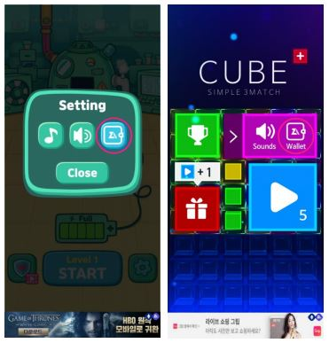

# 안드로이드 연동가이드 &nbsp;<sub>[En](./README.md)</sub>&nbsp;<sub>[Ko](./README.ko.md)</sub>

1. [개요](#1-개요)

2. [제나애드 웹 콘솔에서 광고생성 및 광고 ID 가져오기](#2-제나애드-웹-콘솔에서-광고생성-및-광고-id-가져오기)

3. [SDK 설치](#3-sdk-설치)
    * 프로젝트 설정
    * Sample Guide

4. [퍼미션](#4-퍼미션)
    * Zena2D 에서 사용중인 퍼미션
    * Proguard 적용 후 광고가 보이지 않을 경우

5. [연동하기](#5-연동하기)
    * SDK 초기화
    * 광고 준비요청
    * 광고 준비확인
    * 광고 보이기
    * 배너 위치 지정
    * 배너 제거
    * 제나애드 페이지 (포인트)
    * 코드 샘플
    * IListenerZena2d 콜백
    * 콜백 매개변수 목록
    * 서버응답 메시지 목록

6. [테스트 및 승인요청](#6-테스트-및-승인요청)
    * 테스트
    * 승인 요청방법

7. [추가정보](#7-추가정보)

<br/><br/><br/><br/><br/>

## 1. 개요
---
<br/>

* 실제 프로젝트 환경에 SDK 적용을 위한 가이드 문서입니다.

* android API Level 19 이상의 환경에서 적용을 권장하며 제나애드 웹 콘솔에서 발급받은 “광고 ID” 및 최신 SDK 가 별도로 필요합니다.

* 샘플 프로젝트 실행시에는 실제 발급받은 “광고 ID”로 수정 후 실행해야 합니다.

<br/><br/>

## 2. 제나애드 웹 콘솔에서 광고생성 및 광고 id 가져오기
---
<br/>

1. 앱 생성. (앱 관리 / 앱 생성)

2. 광고 생성. (광고 관리 / 광고 생성)

3. 생성된 광고에 “광고 ID”를 이용해 프로젝트 내에서 함수를 실행 할 수 있습니다.

<br/><br/>

## 3. sdk 설치
---
<br/>

.aar (AndroidArchiveLibrary) 파일과 sampleGuide 를 zip 로 압축하여 제공합니다.

* 프로젝트 설정

    1. zip 파일을 압축 해제하여 .aar 파일을 확인합니다.

    2. AndroidStudio 를 실행하여 sdk 를 설치할 프로젝트를 열고 File -> New -> New Module 선택합니다.

    3. New Module 창이 열리면 import .JAR/.ARR Package 를 선택하고 .aar 파일의 경로를 지정한 후 finish 를 누릅니다.

    4. Project 창에서 aos_zena2d_sdk-x.x.x 모듈이 추가된 것을 확인합니다.

    5. File -> Project Structure 선택 후 Dependencies 탭을 선택, 우측 +버튼, 3 Module dependencies 를 선택하면 aos_zena2d_sdk-x.x.x 모듈이 보입니다.   
    선택하고 OK 를 누릅니다. (또는 build.gradle(Module) 파일의 dependencies 내에 implementation project(path: ‘:aos_zena2d_sdk-x.x.x’) 직접추가. )

    6. Zena2d 에서는 exoPlayer:2.6.0 을 활용하기 때문에 exoPlayer 모듈도 필요합니다.   
    다시 File -> Project Structure 선택 후 Dependencies 탭을 선택, 우측 +버튼, 1 Library dependencies 를 선택합니다.   
    com.google.android.exoplayer:exoplayer-core:2.6.0 를 입력 후 OK 를 누릅니다. (검색목록에 나오지 않아도 입력 후 OK 를 누르면 됩니다.)

        위 과정을 거치면 build.gradle 파일의 dependencies 항목에 implementation project(path: ‘:aos_zena2d_sdk-x.x.x’) 와   
        implementation ‘com.google.android.exoplayer:exoplayer-core:2.6.0’ 이 추가되어 있습니다.

    7. 이제 sdk 를 사용할 준비가 끝났습니다.

* Sample Guide

    - sdk 가 설치된 샘플 프로젝트 입니다. 광고 ID 를 변경해 테스트 해보거나 코드사용 형태를 참고할 수 있습니다.

<br/><br/>

## 4. 퍼미션
---
<br/>

Zena2D SDK 의 .aar 패키지 내에 AndroidManifest.xml 파일을 포함하고 있으며 프로젝트에 또 다른 AndroidManifest.xml 파일이 있다면 빌드시 자동 병합됩니다.

* Zena2D 에서 사용중인 퍼미션
    ```
    <uses-permission android:name="android.permission.INTERNET" />
    ```

* Proguard 적용 후 광고가 보이지 않을 경우 ```proguard-rules.pro``` 파일에 아래 옵션을 추가해 주세요.
    ```
    -keep class com.rhaon.aos_zena2d_sdk.**
    -keep interface com.rhaon.aos_zena2d_sdk.**
    ```

<br/><br/>

## 5. 연동하기
---
<br/>

* SDK 초기화
    ```java
    public void Zena2d.init( Activity, String[] IDs, IListenerZena2d );
    ```
<br/>

* 광고 준비요청
    ```java
    public void Zena2d.readyAd( Product, “BANNER ID or INTERSTITIAL ID or VIDEO ID” );
    // Product : Zena2d.BANNER, Zena2d.INTERSTITIAL, Zena2d.VIDEO
    // (광고종류 : 배너광고, 전면광고, 동영상광고)
    ```
<br/>

* 광고 준비확인
    ```java
    public boolean Zena2d.isReadyAd( Product );
    // Product : Zena2d.BANNER, Zena2d.INTERSTITIAL, Zena2d.VIDEO
    // (광고종류 : 배너광고, 전면광고, 동영상광고)
    ```
<br/>

* 광고 보이기
    ```java
    public void Zena2d.createAd( Product );
    // Product : Zena2d.BANNER, Zena2d.INTERSTITIAL, Zena2d.VIDEO
    // (광고종류 : 배너광고, 전면광고, 동영상광고)
    ```
<br/>

* 배너 위치 지정
    ```java
    public void Zena2d.setBannerGravity( Banner.Mode );
    // Banner.Mode : Banner.Mode.BOTTOM, Banner.Mode.TOP, Banner.Mode.SOFT_KEY
    // (배너위치 : 하단, 상단, 소프트키 위)
    ```
<br/>

* 배너 제거
    ```java
    public void Zena2d.removeBanner( );
    ```
<br/>

* 제나애드 페이지 (포인트)

    유저에게 적립된 포인트를 확인/출금 할 수 있는 창으로 게임내 옵션창에 호출 가능한 메뉴를 제공해야 합니다.   
    메뉴의 모양 및 위치는 게임내 옵션창에 자유롭게 노출합니다. (적용 예시 하단에 첨부되어 있는 버튼 사용 가능)
    ```java
    public void Zena2d.createPointWindow( );
    ```
    <br/>

    - 적용 예시

        </img>

    <br/>

    - 버튼 다운로드

       [](Image/wallet_c.png)  [](Image/wallet_w.png)
    
<br/>

* 코드 샘플
    ```java
    Zena2d zena2d;
    
    @Override
    Protected void onCreate ( Bundle savedInstanceState ) {
        super. onCreate ( savedInstanceState );
        …
        
        String[] ids = { “BANNER ID”, “INTERSTITIAL ID”, “VIDEO ID” };

        zena2d = Zena2d.getInstance( );
        zena2d.setBannerGravity( Banner.Mode.BOTTOM );
        zena2d.init( this, ids, new IListenerZena2d() {
            
            @Override
            public void onInit( Boolean isInit, String message ) {
                Log.d( "zena2d", "onInit : " + isInit + " : " + message );
                //ex : 배너광고 준비
                if ( isInit ) zena2d.readyAd( Zena2d.BANNER, "BANNER ID" );
            }
            
            @Override
            public void onSuccess( int product, String message, String detail ) {
                //미사용중
            }
            
            @Override
            public void onError( int product, String message, String detail ) {
                Log.d( "zena2d", "onError : " + product + " : " + message + " : " + detail );
            }
            
            @Override
            public void onReady( int product, Boolean success, String message ) {
                Log.d( "zena2d", "onReady : " + product + " : " + success + " : " + message );
                
                //ex : 광고 준비확인 및 생성
                if ( zena2d.isReadyAd( product )) zena2d.createAd( product );
            }

            @Override
            public void onCreate( int product, Boolean success, String message ) {
                Log.d( "zena2d", "onCreate : " + product + " : " + success + " : " + message );
            }
            
            @Override
            public void onReward( int product, String reward, int count ) {
                Log.d( "zena2d", "onReward : " + product + " : " + reward + " : " + count );
            }
            
            @Override
            public void onClick( int product ) {
                Log.d( "zena2d", "onClick : " + product );
            }
            
            @Override
            public void onClose( int product, String medID ) {
                Log.d( "zena2d", "onClose : " + product + " : " + medID );
                
                //ex : 광고 닫힘과 동시에 다음 광고준비
                zena2d.isReadyAd( product, medID );
            }
        });
    }
    ```
<br/>

* IListenerZena2d 콜백

    |콜백|설명|
    |---|---|
    |onInit(Boolean, String) |zena2d.init( ); -> SDK 초기화 후 성공여부를 알려줍니다.|
    |onSuccess(int, String, String) |현재 미사용.|
    |onError(int, String, String) |네트워킹 오류 및 응답 오류시 호출됩니다.|
    |onReady(int, Boolean, String) |zena2d.readyAd( ); -> 광고요청, 광고로드를 진행하며 광고준비 성공여부를 알려줍니다.|
    |onCreate(int, Boolean, String) |zena2d.createAd( ); -> 준비된 광고를 화면에 표시합니다.|
    |onReward(int, String, int) |보상형 광고의 보상조건 충족시 호출됩니다.|
    |onClick(int) |광고 클릭시 호출됩니다.|
    |onClose(int, String) |광고 및 포인트 윈도우가 닫힐때 호출됩니다.|
<br/>

* 콜백 매개변수 목록

    |매개변수|설명|
    |---|---|
    |Boolean isInit |광고연동 준비상태.|
    |Boolean success |해당함수의 성공여부.|
    |String message |응답에 대한 상태 및 메시지.|
    |String detail |에러발생시 디테일 메시지.|
    |String reward |보상형 광고에서 설정한 보상이름.|
    |String medID |광고 준비시 전달한 medID.|
    |int product |광고 구분 - 0 or 1 or 2 (0 : BANNER, 1 : INTERSTITIAL, 2 : VIDEO)|
    |int count |보상형 광고에서 설정한 보상갯수.|
<br/>

* 서버응답 메시지 목록

    |메시지|설명|
    |---|---|
    |SUCCESS |성공.|
    |UNKNOWN |알 수 없는 에러입니다.|
    |UNKNOWN_MEDID |알 수 없는 미디어(광고) 아이디 입니다.|
    |AD_DISABLED |광고 비활성화 상태입니다. (웹콘솔 광고 관리에서 노출 중지 한 경우)|
    |AD_NOTFOUND |광고가 없습니다.|
    |AD_EXPIRED |준비된 광고가 만료되었습니다. ReadyAd( )가 필요합니다.|
    |ALREADY_ADREQ |중복된 광고 요청입니다. – sdk 에러.|
    |EXCEEDED_IMPRESSION |노출횟수가 초과 되었습니다. (웹콘솔 광고 관리에서 노출 횟수를 설정한 경우)|

<br/><br/>

## 6. 테스트 및 승인요청
---
<br/>

* 테스트

    - 아래와 같은 제나애드 기본광고가 노출되면 정상입니다.

        |타입|보기|
        |:---:|:---:|
        |배너 |</img>|
        |전면 |</img>|
        |비디오 |</img>|
<br/>

* 승인 요청방법

    - 출시 직전이나 출시 후 승인 요청하면 실제광고가 노출되고 정산됩니다.

    - 다음은 승인요청 메일 예시입니다.   
    <br/>
    수신 : help@zenaad.com   
    내용 : 제나애드 계정 이메일 (필수) : 예) publisher@zenaad.com   
    &nbsp;&nbsp;&nbsp;&nbsp;&nbsp;&nbsp; 회사명 (필수) : 예) (주)제나애드   
    &nbsp;&nbsp;&nbsp;&nbsp;&nbsp;&nbsp; 앱 이름 (필수) : 될 수 있으면 스토어에서 검색 가능한 이름   
    &nbsp;&nbsp;&nbsp;&nbsp;&nbsp;&nbsp; 스토어 주소 (선택) : 유효한 URL 주소

<br/><br/>

## 7. 추가정보
---
<br/>

* Zena2D 에서는 광고식별자 (ADID, IDFA)를 활용하며 리소스의 효율적인 사용을 위해 캐쉬 데이터를 저장합니다. (최대 256MB)

<br/><br/>
