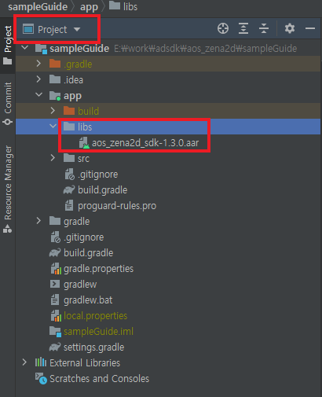

# ANDROID GUIDE &nbsp;<sub>[En](./README.md)</sub>&nbsp;<sub>[Ko](./README.ko.md)</sub>

1. [Overview](#1-overview)

2. [Create an ad in the Zenaad web console and add an Ad ID](#2-create-an-ad-in-the-zenaad-web-console-and-add-an-ad-id)

3. [SDK Installation](#3-sdk-installation)
    * Project Setting
    * Sample Guide

4. [Permission](#4-permission)
    * Permission currently being used in ZenaAD
    * If ads are not visible after applying Proguard

5. [Link](#5-link)
    * Initialize SDK
    * Request AD ready
    * Confirm ad ready
    * Show Ad
    * Position the banner
    * Size the banner
    * Remove banner
    * Check version
    * Code Sample
    * IListenerZena2d Callback
    * Callback Parameter List
    * Server Response Message List

6. [Test and Approval Request](#6-test-and-approval-request)
    * Test
    * Requesting Approva

7. [Additional Information](#7-additional-information)

<br/><br/><br/><br/><br/>

## 1. overview
---
<br/>

* This document details how to apply SDK to a real project.

* SDK is compatible with android API Level 19 +. The ZenaAD Ad ID and latest SDK from the web 
console must be obtained separately.

* When running the sample project, run after editing in the issued Ad ID.

<br/><br/>

## 2. create an ad in the zenaad web console and add an ad id
---
<br/>

1. Create an App. (App Management/App Creation)

2. Create an Ad. (Ad Management/Ad Creation)

3. Functions can be run within your project using the Ad ID in the generated ad.

<br/><br/>

## 3. sdk installation
---
<br/>

A Compressed zip file containing a sampleGuide and .aar (AndroidArchiveLibrary) is provided.

* Project Setting

    1. Unzip the zip file to see the .arr file.

    2. Run Android -> Project in Project View in the same way that AndroidStudio is launched.

        </img>

    3. Move the .aar file to the libs directory.

    4. Add implementation files('libs/aos_zena2d_sdk-x.x.x.aar') to the dependencies section of your build.gradle file. (The file you just moved to libs.)

    5. Since Zena2d utilizes exoPlayer:2.16.1 , the exoPlayer module is also required.   
    Add implementation 'com.google.android.exoplayer:exoplayer:2.16.1' to the dependencies entry in your build.gradle file.

    6. Click Sync Now to reflect the changes in build.gradle.

    7. You are now ready to use sdk.

* Sample Guide

    - This is a sample project with sdk installed. You can change your ad ID to test it, or you can refer to the code usage pattern.

<br/><br/>

## 4. permission
---
<br/>

If there is another AndroidManifest.xml file in the project and the AndroidManifest.xml file is included in the .aar package of the ZenaAD, the SDK will be automatically merged at build time.

* Permission currently being used in ZenaAD
    ```
    <uses-permission android:name="android.permission.INTERNET" />
    ```

* If ads are not visible after applying Proguard Please add the following option to your ```proguard-rules.pro``` file.
    ```
    -keep class com.rhaon.aos_zena2d_sdk.Zena2d {
        public static final int BANNER;
        public static final int INTERSTITIAL;
        public static final int VIDEO;
        public <methods>;
    }

    -keep interface com.rhaon.aos_zena2d_sdk.listener.IListenerZena2d {
        public <methods>;
    }

    -keep class com.rhaon.aos_zena2d_sdk.Banner {
        public <methods>;
    }

    -keep enum com.rhaon.aos_zena2d_sdk.Banner$* {
        public *;
    }
    ```

<br/><br/>

## 5. link
---
<br/>

* Initialize SDK
    ```java
    public void Zena2d.init( Activity, String[] IDs, IListenerZena2d );
    ```
<br/>

* Request AD ready
    ```java
    public void Zena2d.readyAd( Product, "BANNER ID or INTERSTITIAL ID or VIDEO ID" );
    // Product : Zena2d.BANNER, Zena2d.INTERSTITIAL, Zena2d.VIDEO
    // (Ad types : Banner Ad, Full-screen Ad, Video Ad)
    ```
<br/>

* Confirm ad ready
    ```java
    public boolean Zena2d.isReadyAd( Product );
    // Product : Zena2d.BANNER, Zena2d.INTERSTITIAL, Zena2d.VIDEO
    // (Ad types : Banner Ad, Full-screen Ad, Video Ad)
    ```
<br/>

* Show Ad
    ```java
    public void Zena2d.createAd( Product );
    // Product : Zena2d.BANNER, Zena2d.INTERSTITIAL, Zena2d.VIDEO
    // (Ad types : Banner Ad, Full-screen Ad, Video Ad)
    ```
<br/>

* Position the banner
    ```java
    public void Zena2d.setBannerGravity( Banner.Mode );
    // Banner.Mode : Banner.Mode.BOTTOM, Banner.Mode.TOP
    // (Banner Position : Bottom, Top)
    ```
<br/>

* Size the banner
    ```java
    public void Zena2d.setBannerSize( Banner.Size );
    // Banner.Size : Banner.Mode.ADAPTIVE, Banner.Mode.FIXED
    // (Banner Size : fit, default)
    ```
<br/>

* Remove banner
    ```java
    public void Zena2d.removeBanner( );
    ```
<br/>

* Check version
    ```java
    public String Zena2d.getVersion( );
    ```
<br/>

* Code Sample
    ```java
    Zena2d zena2d;
    
    @Override
    Protected void onCreate ( Bundle savedInstanceState ) {
        super. onCreate ( savedInstanceState );
        …
        
        String[] ids = { "BANNER ID", "INTERSTITIAL ID", "VIDEO ID" };

        zena2d = Zena2d.getInstance( );
        zena2d.setBannerSize(Banner.Size.ADAPTIVE);
        zena2d.setBannerGravity( Banner.Mode.BOTTOM );
        zena2d.init( this, ids, new IListenerZena2d() {
            
            @Override
            public void onInit( Boolean isInit, String message ) {
                Log.d( "zena2d", "onInit : " + isInit + " : " + message );
                //ex : Banner Ad Ready
                if ( isInit ) zena2d.readyAd( Zena2d.BANNER, "BANNER ID" );
            }
            
            @Override
            public void onSuccess( int product, String message, String detail ) {
                ///Not in use
            }
            
            @Override
            public void onError( int product, String message, String detail ) {
                Log.d( "zena2d", "onError : " + product + " : " + message + " : " + detail );
            }
            
            @Override
            public void onReady( int product, Boolean success, String message ) {
                Log.d( "zena2d", "onReady : " + product + " : " + success + " : " + message );
                
                //ex : Ad creation and check ready
                if ( zena2d.isReadyAd( product )) zena2d.createAd( product );
            }

            @Override
            public void onCreate( int product, Boolean success, String message ) {
                Log.d( "zena2d", "onCreate : " + product + " : " + success + " : " + message );
            }
            
            @Override
            public void onReward( int product, String reward, int count ) {
                Log.d( "zena2d", "onReward : " + product + " : " + reward + " : " + count );
            }
            
            @Override
            public void onClick( int product ) {
                Log.d( "zena2d", "onClick : " + product );
            }
            
            @Override
            public void onClose( int product, String medID ) {
                Log.d( "zena2d", "onClose : " + product + " : " + medID );
                
                //ex : Close ad while preparing for next ad
                zena2d.isReadyAd( product, medID );
            }
        });
    }
    ```
<br/>

* IListenerZena2d Callback

    |Callback|Description|
    |---|---|
    |onInit(Boolean, String) |zena2d.init( ); -> Initializes SDK and indicates if successful.|
    |onSuccess(int, String, String) |Currently unused.|
    |onError(int, String, String) |Called on network errors and response errors.|
    |onReady(int, Boolean, String) |zena2d.readyAd( ); -> Processes an ad request, loads the ad, and indicates if the ad is ready.|
    |onCreate(int, Boolean, String) |zena2d.createAd( ); -> Displays prepared ad.|
    |onReward(int, String, int) |Called when the reward conditions for compensating ads are met.|
    |onClick(int) |Called when an ad is clicked.|
    |onClose(int, String) |Invoked when the ad and point windows are closed.|
<br/>

* Callback Parameter List

    |Parameter|Description|
    |---|---|
    |Boolean isInit |Ad ready status.|
    |Boolean success |Function success/failure.|
    |String message |Response status and messages.|
    |String detail |Detailed error message.|
    |String reward |Name of the reward entered for a compensating ad.|
    |String medID |The medID sent when preparing an ad.|
    |int product |Ad Category - 0 or 1 or 2 (0 : BANNER, 1 : INTERSTITIAL, 2 : VIDEO)|
    |int count |The reward count set for a compensating ad.|
<br/>

* Server Response Message List

    |Message|Description|
    |---|---|
    |SUCCESS |Success.|
    |UNKNOWN |Unknown Error.|
    |UNKNOWN_MEDID |Unknown Media (Ad) ID.|
    |AD_DISABLED |Ad is currently disabled. (If broadcast is stopped in the Web Console Ad Management)|
    |AD_NOTFOUND |There is no ad.|
    |AD_EXPIRED |The prepared Ad has expired. ReadyAd( ) needed.|
    |ALREADY_ADREQ |Duplicate Ad request. – sdk error.|
    |EXCEEDED_IMPRESSION |Exposure limit exceeded. (If exposure count is set in the Web Console Ad Management)|

<br/><br/>

## 6. test and approval request
---
<br/>

* Test

    - If the following ZenaAD native ads are displayed, then the system is running normally.

        |Type|Example|
        |:---:|:---:|
        |Banner |</img>|
        |Full-screen |</img>|
        |Video |</img>|
<br/>

* Requesting Approval

    - Requesting approval immediately before or after launch will broadcast your ad and accumulate balance.

    - Here is an example of an approval request email:   
    <br/>
    Contents : help@zenaad.com <br/>
    Company Info : ZenaAD account email (required): ex) publisher@zenaad.com <br/>
    &nbsp;&nbsp;&nbsp;&nbsp;&nbsp;&nbsp; Company Name (required): ex) ZenaAD Co., Ltd. <br/>
    &nbsp;&nbsp;&nbsp;&nbsp;&nbsp;&nbsp; App Name (required):  A searchable name in the Store, if <br/>
    &nbsp;&nbsp;&nbsp;&nbsp;&nbsp;&nbsp; Store Address (optional): Valid URL Address

<br/><br/>

## 7. additional information
---
<br/>

*  ZenaAD uses ad identifiers (ADID, IDFA) and saves cash data for efficient resource use. (Up to 256 MB)

<br/><br/>
